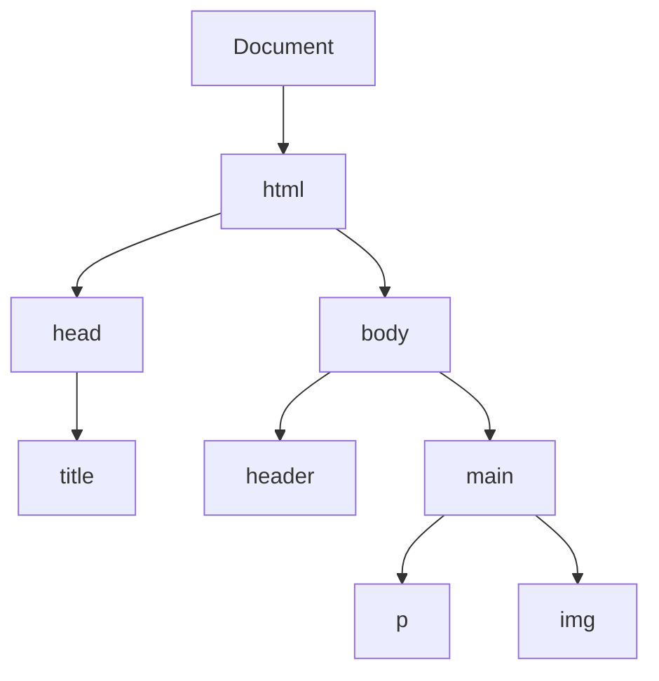
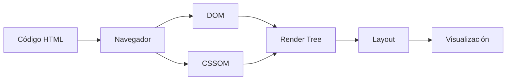
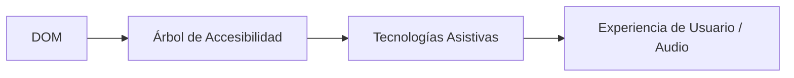

## 🚀 Flujo de creación de una página: HTML y DOM

Cuando escribimos código HTML, el navegador (Chrome, Firefox, etc.) lo interpreta línea por línea para transformar ese texto en la página visual que vemos. Este proceso ocurre en varios pasos internos:

### El Proceso de Renderizado (Critical Rendering Path)

1.  **Interpretación:** El navegador lee el código HTML.
2.  **Construcción del DOM:** A medida que lee, construye el **Document Object Model** en memoria.
3.  **Construcción del CSSOM:** Al encontrar estilos, construye el **CSS Object Model** en paralelo.
4.  **Render Tree:** Combina el DOM y el CSSOM para saber qué elementos mostrar y cómo.
5.  **Layout (Reflow):** Calcula las posiciones y tamaños exactos de cada elemento.
6.  **Paint (Repaint):** Dibuja los píxeles finales en la pantalla.

---

## 🌳 El DOM (Document Object Model)

El **DOM** es una estructura de árbol basada en **Nodos**, los cuales representan cada etiqueta de nuestro HTML. Es importante entender que el DOM no es el código fuente, sino una representación viva de él cargada en la memoria del navegador.

### Concepto de Nodo
En una estructura de árbol, cada elemento es un **Nodo**. Existe una jerarquía de padres, hijos y hermanos:

Gracias al DOM, lenguajes como **JavaScript** pueden interactuar con los elementos, cambiarlos, borrarlos o añadir nuevos, haciendo que la página sea dinámica.

---

## 🎨 El CSSOM (CSS Object Model)

Es el equivalente al DOM pero para los estilos. El navegador procesa todas las reglas CSS (internas, externas o en línea) y crea este modelo para saber qué estilos aplicar a cada nodo del DOM. El **Render Tree** es el resultado final de la unión entre el DOM y el CSSOM.

---

## ♿ El Árbol de Accesibilidad (AOM)

De forma paralela al DOM, el navegador construye siempre el **Árbol de Accesibilidad**. Este modelo filtra los nodos irrelevantes (como elementos puramente decorativos) y enriquece la información para las **Tecnologías de Asistencia** (como lectores de pantalla).

---

## 🔄 Resumen de los Flujos

### Flujo Estándar

### Flujo con Accesibilidad

> [!IMPORTANT]
> El navegador no espera a que todo el HTML esté cargado para empezar a pintar. A medida que va recibiendo datos, va construyendo nodos y mostrándolos, lo que permite que el usuario empiece a ver contenido lo antes posible.